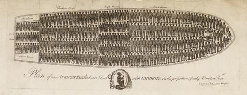

[Home](index.md) · [Assignments & Grades](assignments-and-grades.md) · [Policies](policies.md) · [Schedule](schedule.md) · [Advanced DH Examples](Readings/CodingWork/AdvancedDHExamples.md)

<a href="print.html" style="display:inline-block;margin:0.5em 0;padding:0.6em 1.4em;font-size:1em;background:#2a7ae2;color:white;border-radius:4px;text-decoration:none;">&#128424; Print / Save as PDF</a>

---

# HIST280 / DH200 – Data and History 
**Fall 2026** 
**Professor Frank “Trey” Proctor III**

Class:  TTh 130-250 201 Knobel Hall 

Office Hours:  T\&TH 10-1120 **and by appointment (in person or via Zoom)** 
Office: 404 Fellows Hall 
Email: [proctorf@denison.edu](mailto:proctorf@denison.edu) 
Preferred pronouns: he/him/his 

## Course Description:

"Data in History" asks four core questions: What counts as data? Why do people trust numbers? How has that trust shifted over time? And how can we use data \- including AI-assisted methods \- to study the past? This course combines hands-on learning in coding, historical thinking, and AI-assisted analysis with big historical datasets, and considers how numeric thinking has come to organize modern life. Using "big-data" approaches to the history of African slavery in the Americas — drawing on sources like ship manifests, censuses, and plantation records — we'll examine what these sources reveal and conceal about the past, while weighing the ethical and methodological limits of working with such evidence, including the new possibilities and risks that AI tools bring to historical analysis.

By the end of this class, hopefully you will have developed a marketable set of skills to harness data and the critical awareness to do so ethically.

This course is a hands-on, experimental, learn-as-we-go experience that introduces both students and the faculty to the use of digital tools and sources to conduct original historical research, formulate historical arguments, and communicate historical ideas in digital formats (audio, visual, textual).

## Learning Goals

* **Coding** \- learn the rudiments of coding, particularly how process, analyze, and visualize data using the Python programming language
* **AI Assisted Coding** \- learn how to use LLMs ([Claude.ai](http://Claude.ai)) to supercharge your ability to wrangle, analyze, and visualize data
* **History** \- understand data as a historical artifact (or a historical construction) and its role within different historical topics. To explore how humanities understand data and knowledge creation.
* **Data Literacy** \- evaluate data within its larger cultural, social, and political contexts.

## Office Hours:
The purpose of office hours is to make myself available to my students to discuss our class, their assignments, and perhaps even their larger Denison experience.  I am here and ready to help/talk/listen.

I would strongly encourage you to take advantage of office hours, or to set up an appointment.  I can promise that doing so will help you be your most effective and successful in my course.
I look forward to talking with you all often. To schedule an appointment outside of regular office hours, just send me an email with a request and recommend some times (my Google calendar is uptodate). We can schedule remote (or with enough lead time in person) appointments.

## Readings:

*All assigned readings will be available from the Course Schedule in Canvas for download and printing.  Please bring printed copies of all assigned readings to class on the day for which they appear on the syllabus.*

## DenAI
Denison will provide access to various LLM models through DenAI ([denai.denison.edu](denai.denison.edu)). We will really on the Claude Models - Sonnet and Opus (for big projects). To maintain your access to DenAI you will need to complete an AI training offered by the University. More information to follow.

## About The Course:

### How this course is designed
In the name of full transparency, this class is an experiment.  I am a historian, and I am expert in the history of slavery in Spanish America specifically. I am growing as a digital historian (you’ll get to see some of my work later in the semester), and I have experienced how the advent of LLMs like Claude and ChatGPT have accelerated my ability to do that work. I am not a computer scientist, or a data analyst, and I can GUARANTEE that many (if not most) of you are much more knowledgeable than I in this regard. So, I will be learning alongside you. This class is a hybrid \- unlike a traditional coding course, you’ll be studying data through a historical lens; unlike a traditional history class, we’ll be learning the basics of code and to use LLMs to create data driven components to make historical arguments.

I have designed this class with three interrelated and interwoven tracks:

**Track 1 \- History, Data, and Slavery** 
The goals of this track are perhaps two fold.  First, we want to come to understand how historians and economic historians (these are not the same) have deployed data (big and small) to better understand the institution of African slavery in the United States.  Second, this will allow us to develop a historical and theoretical framework for understanding just what “data” are. A central theme of the course is that “all data have a history.” Through our coursework, we will learn about the historical dimensions of data: how, when, by whom, and why certain types of data have been collected. The goal is to build our capacity to decide when and how data should or shouldn’t be used.

**Track 2 \- Programming in Python** 
The course will teach you the very basics of using the Python programming language to work with data. Again, the goal here is two fold. 1\) Algorithmic thinking and Failure; and 2\) to prepare you for using AI to do advanced data analysis for your final project. In order to do AI-assisted coding, analysis, and visualization well, you have to understand how code works. It will help you write better prompts to an AI and it will allow you to assess how and why an LLM made an error.

**Track 3 \- Digital Humanities in the Age of AI** 
One of the more exciting realities of the Age of AI is how it lowers the entry threshold to doing advanced digital humanities work. With a little coding, some understanding of the dangers of AI, and some understanding of how LLMs work, we can really accelerate our ability to work with data and create meaningful visualizations.

NOTE: In the end, all of the types of analyses, data wrangling, and visualizations we will play with during the semester can be done in a coding environment. If you are uncomfortable using LLMs for any reason, and prefer to work in a traditional coding environment that is totally acceptable.

## Learning Community
This course will work best as a shared experiment rather than a lecture \- you're not just learning to code, read critically, or think like a historian, you're building toward what AI-assisted historical work can and can't do, and everyone in the room will get there together, including me. That means your fumbles, half-working scripts, and half-formed interpretations are part of the material, not embarrassments to hide — the "fail log" habit we'll build into our assignments is as much about normalizing that as it is about debugging. I'll ask you to be generous with classmates (and faculty) who are earlier in their coding journey than you, with classmates for whom thinking historically feels alien, and with yourself when the AI gets something wrong that you didn't catch — noticing that, and asking why, is exactly the habit of mind a historian brings to any source, data included.

## Acknowledgements  
As a relative novice in data, coding, and digital humanities, I have borrowed heavily from a number of related courses, particularly those taught by Cameron Blevins and Anastacia Slater. In addition, I have used [Claude.ai](http://Claude.ai) to assist in the construction of the course syllabus (I’d be happy to discuss how). 

---

[Home](index.md) · [Assignments & Grades](assignments-and-grades.md) · [Policies](policies.md) · [Schedule](schedule.md) · [Advanced DH Examples](Readings/CodingWork/AdvancedDHExamples.md)
